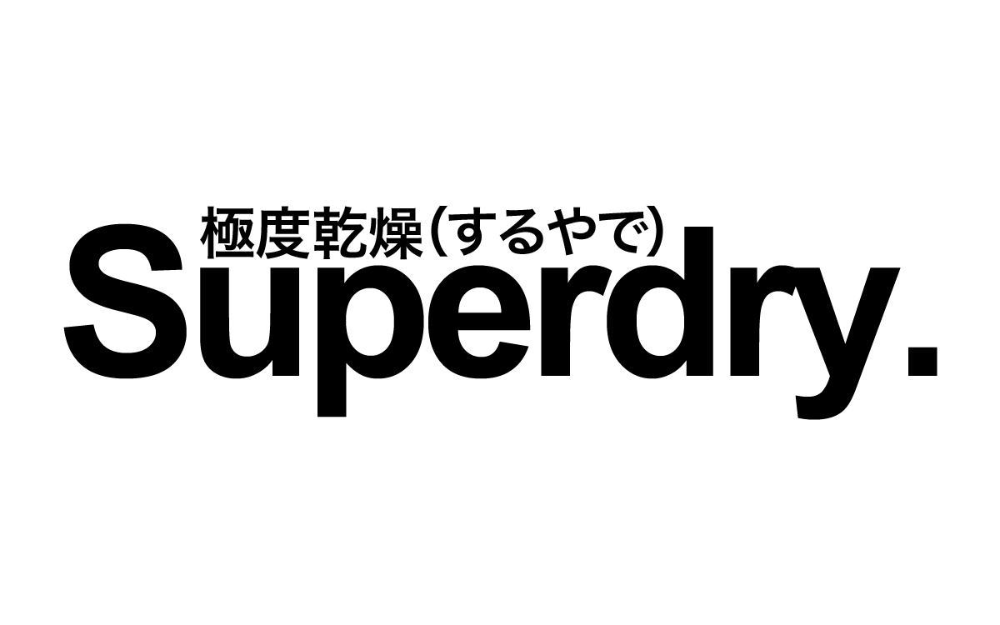
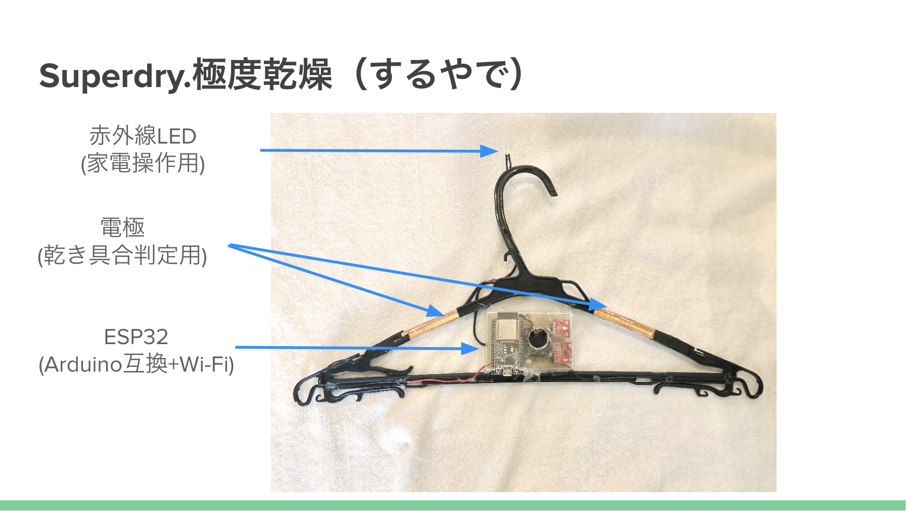
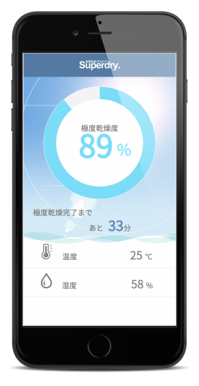
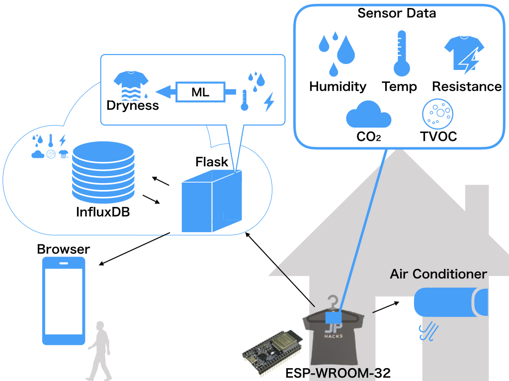

# Superdry. 極度乾燥（するやで）

### 動画

#### ハンガー

#### ブラウザのスクリーンショット

## 製品概要
[説明スライド](https://docs.google.com/presentation/d/1nkwwaOGhunLVJAqDFw6KqY2loXBuYRNtskNffqp4-LA/edit?usp=sharing)
### 部屋干し X Tech

### 背景（製品開発のきっかけ、課題等）
<!-- ここに
- こんかいのプロダクトの開発に至った背景
- 着目した顧客・顧客の課題・現状
を記入してください -->

梅雨や雨の時に部屋干しすると臭くなったことはありませんか？  
部屋干しの臭いの原因である生乾き臭は長い乾燥時間によって発生します．  
それを防ぐためには，エアコンなどを使用して早く乾かす必要があります．

しかし，  
#### 「外出するときにつけっぱなしにするのは電気代が勿体ない」  
#### 「タイマーをかけるにしてもいつ乾くかわからない」  
など様々な問題があります．

そこで私たちは**ハンガー**を**IoT化**することでこれらの問題を解決します！

### 製品説明（具体的な製品の説明）
<!-- こちらに製品の概要・特徴について説明を記載してください。 -->

ここがすごい！！

<!-- - ハンガーに電極を付けて衣服の乾き具合を測定 -->
<!-- - 温度・湿度を測定し，機械学習により残り時間を推定 -->
<!-- - InfluxDBでグラフが見れるよ -->
<!-- - ブラウザで室内環境，乾き具合の経過が見れる -->
<!-- - BLEでWi-FiのSSIDやPASSを設定できるよ -->

<!-- ### 特長（ここがすごい！！）-->

#### 1. ハンガーに取り付けられた電極で乾き具合を正確に測定

#### 2. 機械学習によって乾燥までの時間を推定

#### 3. 乾燥具合に応じて家電を効率的に制御

#### 4. 端末から室内環境，乾き具合の経過が見れる

### 解決出来ること
<!-- この製品を利用することによって最終的に解決できることについて記載をしてください。 -->

このハンガーを使用することにより，乾くまでの間エアコンを駆動し乾燥時間を早めることが可能です．  
また，乾燥具合や温湿度の情報から機械学習によって乾燥時間が推定されるので，洗濯物を取り込める時間がわかります．  
さらに，洗濯物が乾くと自動でエアコンが停止するため，コストを抑えることが可能です．

### 今後の展望
<!-- 今回は実現できなかったが、今後改善すること、どのように展開していくことが可能かについて記載をしてください。 -->

今回は服を早く乾かすことに焦点を当ててプロダクトをつくりましたが，更に実用性を持たせるためには，エアコンの使い方をより工夫する必要があります．
エアコンをただ服を乾かす目的で使うのではなく，外出時にエアコンの冷暖房を入れておき，帰ってくる時間に合わせて服の乾燥と快適な温度調整を行うことができれば，ハンガーに新たな付加価値を付けることができます．
また，ハッカソン中だけでは実験期間が短く学習用データが足りなかったので，今後実験を重ねることで乾燥にかかる時間予測の精度を上げていきたいです．

## 開発内容・開発技術
### 活用した技術

#### システム構成図
<!-- #### API・データ -->
<!-- 今回スポンサーから提供されたAPI、製品などの外部技術があれば記述をして下さい。 -->

#### フレームワーク・ライブラリ・モジュール [詳細](servers/README.md)
* Server: Flask (Python)
* DB: InfluxDB

#### デバイス [詳細](hardware/README.md)
* ESP32 (Arduino互換+Wi-Fi+BLEモジュール)

<!-- ### 研究内容・事前開発プロダクト（任意） -->
<!-- ご自身やチームの研究内容や，事前に持ち込みをしたプロダクトがある場合は、こちらに実績なども含め記載をして下さい。-->

### 独自開発技術（Hack Dayで開発したもの）
- 洗濯物の乾燥度合い測定(電極間の水の電気抵抗を測定しています)
- 機械学習を用いた残りの乾燥時間の推定
- エアコンのリモコンが送信している赤外線信号データの解析
- 解析した赤外線を活用したエアコン制御
- 各種システムの統合

#### 2日間に開発した独自の機能・技術
<!-- * 独自で開発したものの内容をこちらに記載してください -->
* 特に力を入れた部分をファイルリンク、またはcommit_idを記載してください（任意）
